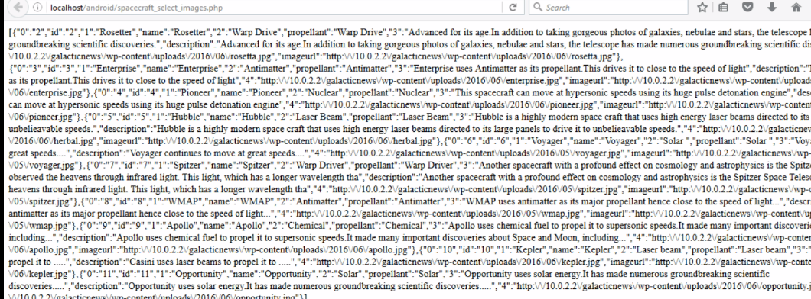
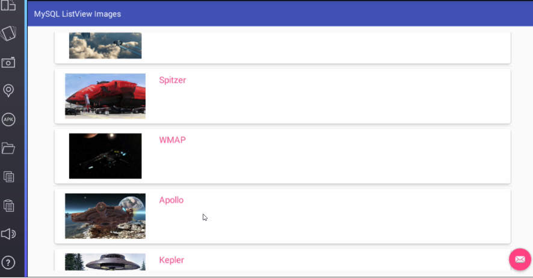

# MySQL_ListView_Images
Display Images and Text from MySQL Database to ListView

Android MySQL Images with ListView.

* The table Structure :

* We retrieve image urls and texts from MySQL database and render in a custom listview.
* We fetchn images asynchronously using Picasso.
* While loading an image we show a placeholder image.
* We offload background tasks like making network calls to server and parsing JSON data to AsyncTask.
* We show progress dialog while loading the data.

* The retrieved JSON in a browser.

* Result

